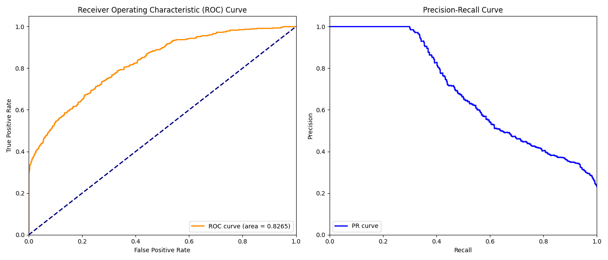
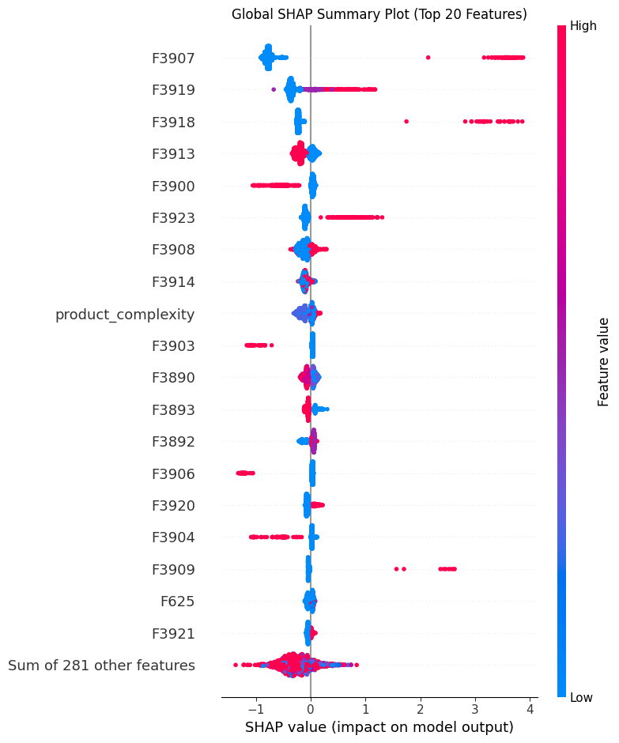
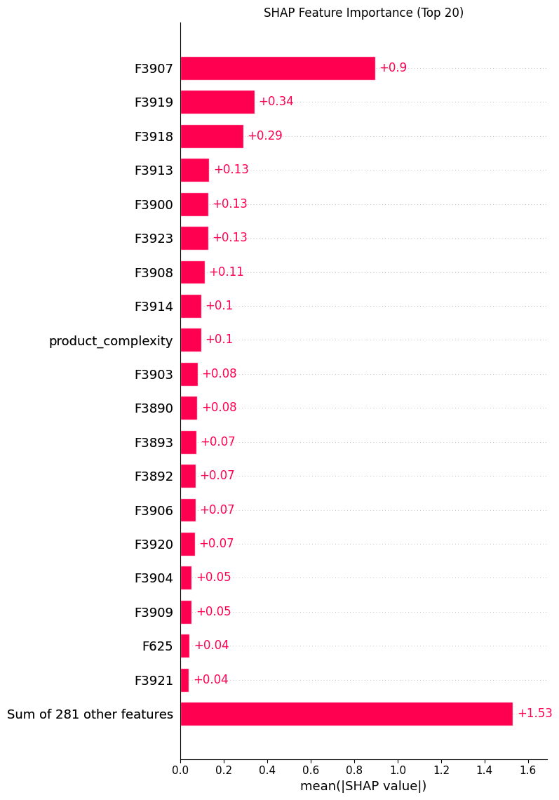
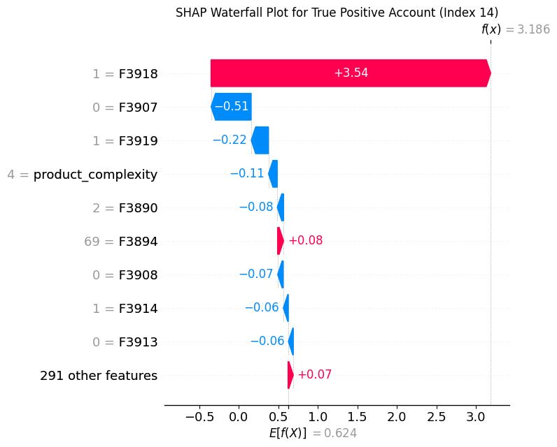

# 🛡️ FraudGraph Shield: Transaction Scorer & Mule Detector (Phase 1)

FraudGraph Shield is a production-grade machine learning system designed to detect fraudulent transactions and potential money mule accounts for small businesses and banking platforms. 

This repository implements **Phase 1 (Data & Models)**, delivering a fully reproducible end-to-end LightGBM model pipeline with structured preprocessing, automated feature selection, hyperparameter optimization, and SHAP-based explainability.

---

## 📊 Phase 1 Deliverables & Architecture

The system follows a strict **Think → Decide → Act → Observe** agentic pipeline. It handles high-dimensional transaction data with the following core components:

```
[ Raw CSV Data ] ──> [ Preprocessing & Engineering ] ──> [ Feature Selection (R1 & R2) ] ──> [ SMOTE + 5-Fold CV ] ──> [ Optuna Bayesian Tuning ] ──> [ Final LightGBM Classifier ]
```

1. **Preprocessing Pipeline (`preprocessor.py`)**: A robust, state-preserving transformer (`FraudPreprocessor`) that handles high-dimensional, sparse tabular data.
2. **Feature Selection (`feature_selection.py`)**: A two-stage feature selection process (univariate filters followed by tree-based importance) that narrows down 3,924 raw features to the top 300 predictive features.
3. **Model Orchestration (`train.py`)**: End-to-end training, cross-validation, hyperparameter search via Optuna, test set evaluation, and model card generation.
4. **Explainability & Model Card (`model_card.md`)**: Complete diagnostics including ROC/PR curves, confusion matrices, classification reports, and SHAP explainability plots.

---

## 🛠️ Data Preprocessing & Feature Engineering

To combat extreme missingness and categorical metadata representation, the pipeline implements:
* **Target Binarization**: Target variable `F3897` (suspicious volume score) is binarized where `0` represents clean accounts and `>= 1` represents suspicious/mule activity.
* **Neutral Imputation**: High-dimensional velocity ratio features (`F1–F3885`) are filled with `0.5` (a neutral score signifying no change relative to account history).
* **Missingness Indicators**: Automatical creation of binary `{col}_missing` flags for any feature with >5% missingness.
* **Target Ordinal Encoding**: Category variables `F3886` (Account Type) and `F3891` (Occupation Code) are mapped to ordinal values based on the target class probability inside each cross-validation fold to prevent data leakage.
* **Tenure Calculation**: Computes account tenure relative to reference date `2024-01-01` using `F3888`.
* **Product Complexity Score**: Counts active product flags across `F3900–F3924`.
* **Peer Deviation Composite**: Computes the mean absolute deviation of variables `F3880–F3885`.

---

## 🔍 Two-Stage Feature Selection

Given 3,924 raw columns, training is optimized using a dual-stage filter:
1. **Round 1 (Filter)**: Automatically removes features with **>95% missingness** or **zero variance** (constant columns).
2. **Round 2 (LightGBM built-in importance)**: Fits a baseline LightGBM model on the filtered features and selects the **top 300 features** with the highest split/gain importance.

---

## 📈 Model Performance & Validation

### Receiver Operating Characteristic (ROC) & Precision-Recall (PR) Curves


### Key Metrics on 20% Holdout Test Set (Leak-Free)
* **Holdout AUC-ROC**: **`0.8113`**
* **F1-Score**: **`0.5234`**
* **Precision**: **`0.7568`**
* **Recall**: **`0.4000`**

### Threshold Decision Matrix
Depending on operational risk tolerance, the classification threshold can be tuned:

| Threshold | Precision | Recall | F1-Score | Detection / Flagging |
|---|---|---|---|---|
| **0.3** | 50.40% | 60.71% | 55.08% | Higher recall, flags 506 transactions |
| **0.4** | 62.73% | 48.10% | 54.45% | Balanced trade-off, flags 322 transactions |
| **0.5** (Default) | 75.68% | 40.00% | 52.34% | High confidence, flags 222 transactions |
| **0.6** | 88.62% | 35.24% | 50.43% | Low operational overhead, flags 167 transactions |

---

## 🧠 Model Interpretability (SHAP Analysis)

We use SHAP (SHapley Additive exPlanations) to explain the global behavior of the model and decompose individual transaction scores.

### 1. Global Feature Contributions (Beeswarm)
Shows the top 20 features and their directional impact on predictions.


### 2. Feature Importance Summary (Bar Plot)
Plots the mean absolute SHAP value for feature contribution.


### 3. Individual Decompositions (Waterfall Plot)
Explains exactly why a specific account was flagged as fraud (True Positive example).


---

## 🚀 How to Run (End-to-End Replication)

### 1. Requirements & Setup
Ensure you have a Python environment (>=3.10) and run:
```bash
pip install -r requirements.txt
```

### 2. Run Training Pipeline
To run the full preprocessing, tuning, holdout evaluation, explainability plots, and model card generation:
```bash
python train.py
```

All output assets will be saved to:
* `preprocessor.joblib` & `model.joblib` (Trained production model)
* `selected_features.joblib` (Top 300 feature list)
* `plots/` (All diagnostic and SHAP charts)
* `model_card.md` (Detailed performance report)
